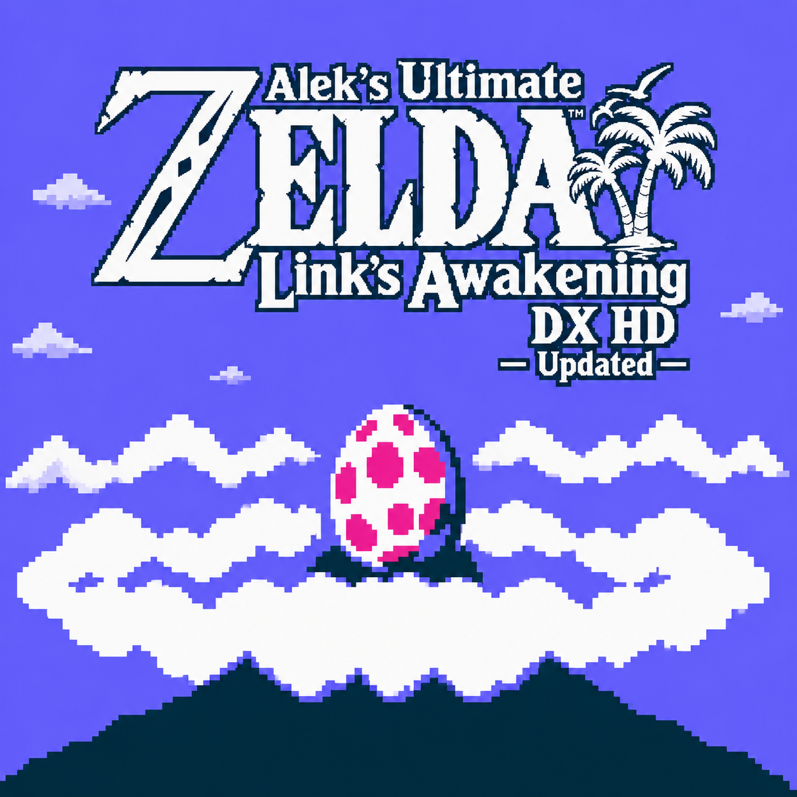
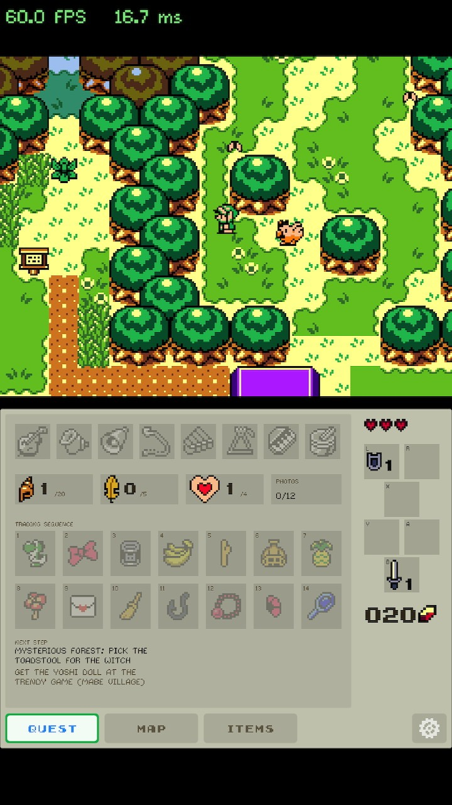
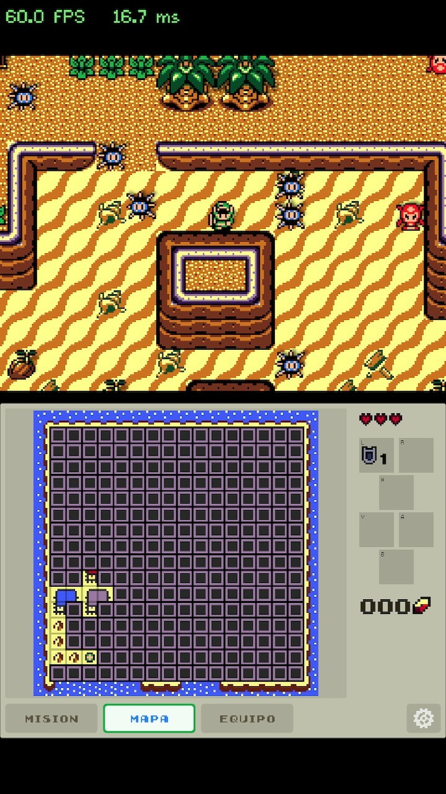
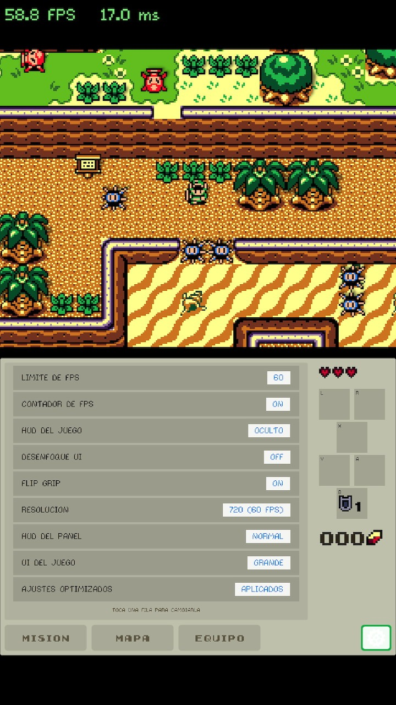
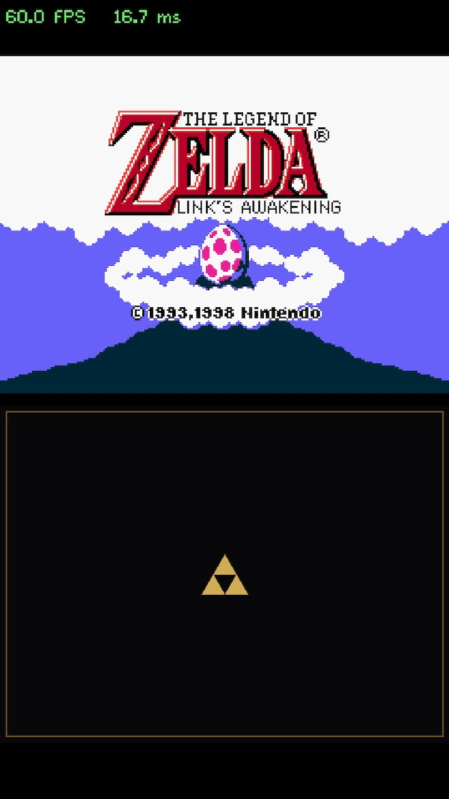
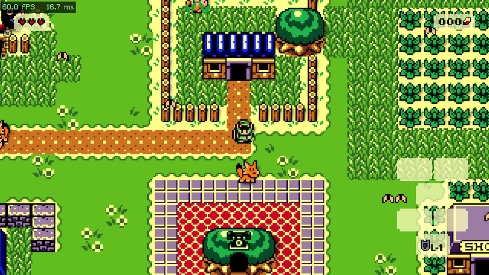
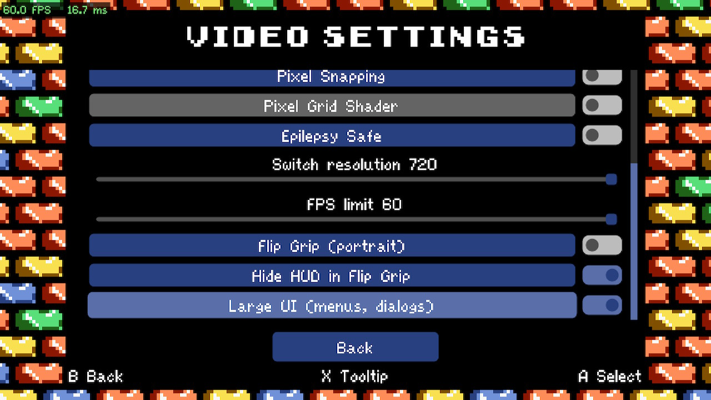

<h1 align="center">The Legend of Zelda: Link's Awakening DX HD — Alek's Ultimate NX Edition</h1>

Nintendo Switch homebrew port of <a href="https://gitlab.com/bighead.0/ladxhd_updated">bighead's <i>ladxhd_updated</i></a> (v2.0.8) — 60 fps in handheld, Flip Grip portrait mode with a touch companion panel, in-game Switch settings.

<a href="#english">English</a> · <a href="#español">Español</a> · <a href="https://gbatemp.net/threads/release-zelda-links-awakening-dx-hd-aleks-ultimate-nx-edition-switch-homebrew-60fps-flip-grip-touch-second-screen.684512/">GBAtemp thread</a> · <a href="https://github.com/Alexgg1014/The-Legend-of-Zelda-Link-s-Awakening-DX-HD-Alek-s-Ultimate-NX-Edition/releases">Releases</a>

---

## English

> **Unofficial fan project.** This repository contains **no game assets**. You need your own copy of *Link's Awakening DX HD* v1.0.0 and bighead's patcher. All game art, music and maps belong to Nintendo; the HD remake code is bighead's; this port only adds the Switch layer.

### Screenshots

   

 

### Features

- **60 fps in handheld, no overclock** — renders at 720p (the handheld screen's real resolution) instead of 1080p. 1080p mode available for docked play (30 fps).
- **Flip Grip / portrait mode** (`L + R + X`): game on top in 4:3, **companion panel** below, DS-style — same layout as the Alek's Ultimate editions of *Minish Cap* and *A Link to the Past*.
- **Touch companion panel** with four tabs:
  - **QUEST** — the 8 instruments, seashells, golden leaves, heart pieces, photos, the 14-step **trading sequence**, and a **story guide** ("next step") worked out from your inventory.
  - **MAP / DUNGEON** — the game's own map, auto-switches to the dungeon map when you enter one.
  - **ITEMS** — your bag, TMC-style: **tap an item to put it on A**, or **drag it onto any button** (A/B/X/Y, or L/R if you use 6 buttons).
  - **⚙ SETTINGS** — fps limit, fps counter, game HUD on/off, UI blur, Flip Grip, resolution, panel HUD size, game UI size, and an **Optimized Settings** preset (two taps to confirm).
- **Sidebar HUD** on the panel (hearts, equipped items in the button layout, rupees, keys) so the game HUD can be hidden in Flip Grip.
- **Switch options inside the game's own menu** — Pause → Settings → Video: resolution, fps limit, Flip Grip, hide HUD, large UI.
- Panel translated to **English, Spanish, Portuguese, French, German and Italian** (follows the game language). Story guide: English and Spanish.
- Zero new art: everything on the panel is drawn from the game's own sprites, fonts and colors (respects your LAHDMods).

### Requirements

- Nintendo Switch with **Atmosphère** (tested on a v1 Switch, handheld). Launch from **hbmenu via title override** (hold R on a game), *not* from the Album — the Album applet doesn't have enough memory.
- Your own **Link's Awakening DX HD v1.0.0** (PC) and bighead's **LADXHD Patcher v2.0.8** from the [releases page](https://gitlab.com/bighead.0/ladxhd_updated/-/releases).
- Windows PC for the one-time asset patching step.

### Install

1. **Generate the assets** (once): run `LADXHD-Patcher.exe` on your v1.0.0 copy with **Platform: Windows** and **Target: OpenGL** → **Patch**. It produces the `Content` and `Data` folders for v2.0.8.
2. On the SD card create `sdmc:/switch/zelda-ladxhd/` and copy into it:
   - `ProjectZ.Switch.nro` (from this repo's release)
   - the patched `Content/` folder
   - the patched `Data/` folder (you can leave out `Data/Backup`)
3. Launch from hbmenu. The first start takes a bit longer while the game loads its assets.

Your settings live in `sdmc:/switch/zelda-ladxhd/switchsettings.txt` (plain text) and saves in `SaveFiles/`.

### Controls

| Combo | Action |
|---|---|
| `L + R + X` | Toggle Flip Grip (portrait) ↔ normal |
| `L + R + ←/→` | Switch companion tab without touching |
| Touch | Tabs, settings rows, items (tap = A, drag = choose button) |

Everything else is the game's own controls.

### Known issues / notes

- 1080p mode holds 30 fps (GPU bound); 720p is the default and hits 60.
- Story guide and the Video-menu options are English/Spanish only (the panel itself has 6 languages).
- Docked mode is untested; Flip Grip is a handheld feature.
- If the game ever shows a black panel or the touch stops responding, check `crash/secondscreen.log` on the SD and open an issue with it.

### Updating

Each release ships the NRO **paired with the upstream version it was built for**. When bighead releases a new version, this port gets rebased and re-released; the release notes say which patcher version to use. Don't mix a newer NRO with older `Content`/`Data` (or vice versa).

### Building

The Switch layer lives entirely in `ProjectZ.Switch/` (C#, NativeAOT for linux-arm64 linked with devkitPro/libnx), plus a handful of small, documented patches to `ProjectZ.Core` (`RenderSizeOverride`, `UiScaleRoundUp`, `IPlatformVideoOptions`). See `SWITCH_BUILD.md` in the source.

### Transparency: built with AI

This port was developed by Alexgg1014 **with Claude (Anthropic) as a coding assistant**: a large part of the Switch layer, the debugging of the NativeAOT/libnx crashes and the rendering fixes were written in pair-programming sessions with the AI, with Alex directing the design, testing every build on real hardware and making the calls. The cover art was made with AI image generation and then hand-edited. Nothing here is autogenerated without a human having tested it on a Switch; if something is broken, it's on us, not on the model — open an issue.

### Credits

- **bighead** — [ladxhd_updated](https://gitlab.com/bighead.0/ladxhd_updated), the HD remake this port is built on, and its patcher.
- **delsonazevedo** — [Zelda-LA-DX-HD-Updated](https://github.com/delsonazevedo/Zelda-LA-DX-HD-Updated), the **first Switch port** of LADXHD (v1.7.x, NativeAOT + libnx). This edition started from that work; the shims and the build pipeline descend from it.
- **Alexgg1014** — this edition: v2.0.x rebase, 60 fps, Flip Grip mode, companion panel, Switch settings.
- **MonoGame**, **devkitPro / libnx**, **SDL2**, **Mesa** — the stack that makes .NET run on a Switch.
- The Alek's Ultimate editions of *The Minish Cap* and *A Link to the Past* — donors of the second-screen design.
- Nintendo — *The Legend of Zelda: Link's Awakening DX*. This project is not affiliated with or endorsed by Nintendo.

---

## Español

> **Proyecto fan no oficial.** Este repositorio **no incluye assets del juego**. Necesitas tu propia copia de *Link's Awakening DX HD* v1.0.0 y el patcher de bighead. El arte, la música y los mapas son de Nintendo; el código del remake HD es de bighead; este port solo añade la capa de Switch.

### Qué es

- **60 fps en portátil sin overclock**: renderiza a 720p (la resolución real de la pantalla) en vez de 1080p. Modo 1080p disponible para dock (30 fps).
- **Modo Flip Grip / vertical** (`L + R + X`): juego arriba en 4:3, **panel companion** abajo, estilo DS — el mismo layout que las ediciones Alek's Ultimate de *Minish Cap* y *A Link to the Past*.
- **Panel táctil** con cuatro pestañas:
  - **MISIÓN** — los 8 instrumentos, caracolas, hojas doradas, piezas de corazón, fotos, la **cadena de intercambio** de 14 pasos y una **guía de historia** ("siguiente paso") deducida de tu inventario.
  - **MAPA / MAZMORRA** — el mapa del propio juego; cambia solo al mapa de la mazmorra al entrar.
  - **EQUIPO** — tu bolsa, a lo TMC: **toca un objeto para ponerlo en A**, o **arrástralo a cualquier botón** (A/B/X/Y, o L/R si usas 6 botones).
  - **⚙ AJUSTES** — límite de fps, contador, HUD del juego, desenfoque UI, Flip Grip, resolución, tamaño del HUD del panel, tamaño de la UI del juego y un preset de **Ajustes Optimizados** (dos toques para confirmar).
- **HUD en la barra lateral** del panel (corazones, objetos equipados en la forma de los botones, rupias, llaves), para poder ocultar el HUD del juego en Flip Grip.
- **Opciones Switch dentro del menú del juego**: Pausa → Ajustes → Vídeo: resolución, límite de fps, Flip Grip, ocultar HUD, UI grande.
- Panel traducido a **inglés, español, portugués, francés, alemán e italiano** (sigue el idioma del juego). Guía de historia: inglés y español.
- Cero arte nuevo: todo el panel se dibuja con los sprites, fuentes y colores del propio juego (respeta tus LAHDMods).

### Requisitos

- Switch con **Atmosphère** (probado en Switch v1, portátil). Lanzar desde **hbmenu con title override** (mantener R al abrir un juego), *no* desde el Álbum: al applet del Álbum no le alcanza la memoria.
- Tu **Link's Awakening DX HD v1.0.0** (PC) y el **LADXHD Patcher v2.0.8** de bighead ([releases](https://gitlab.com/bighead.0/ladxhd_updated/-/releases)).
- Un PC con Windows para el paso único de generar los assets.

### Instalación

1. **Genera los assets** (una vez): ejecuta `LADXHD-Patcher.exe` sobre tu copia v1.0.0 con **Platform: Windows** y **Target: OpenGL** → **Patch**. Genera las carpetas `Content` y `Data` de v2.0.8.
2. En la SD crea `sdmc:/switch/zelda-ladxhd/` y copia dentro:
   - `ProjectZ.Switch.nro` (de la release de este repo)
   - la carpeta `Content/` parcheada
   - la carpeta `Data/` parcheada (puedes omitir `Data/Backup`)
3. Lanza desde hbmenu. El primer arranque tarda un poco más mientras carga los assets.

Tus ajustes están en `sdmc:/switch/zelda-ladxhd/switchsettings.txt` (texto plano) y las partidas en `SaveFiles/`.

### Controles

| Combo | Acción |
|---|---|
| `L + R + X` | Flip Grip (vertical) ↔ normal |
| `L + R + ←/→` | Cambiar pestaña del panel sin tocar |
| Toque | Pestañas, filas de ajustes, objetos (toque = A, arrastre = elegir botón) |

Lo demás son los controles del juego.

### Problemas conocidos / notas

- El modo 1080p se queda en 30 fps (límite de GPU); 720p es el predeterminado y llega a 60.
- La guía de historia y las opciones del menú de Vídeo están solo en inglés/español (el panel en 6 idiomas).
- Modo dock sin probar; Flip Grip es una función portátil.
- Si el panel sale negro o el toque deja de responder, mira `crash/secondscreen.log` en la SD y abre un issue con él.

### Actualizaciones

Cada release lleva el NRO **emparejado con la versión de upstream para la que se compiló**. Cuando bighead publique versión nueva, el port se rebasa y se vuelve a publicar; las notas de la release dicen qué versión del patcher usar. No mezcles un NRO nuevo con `Content`/`Data` viejos (ni al revés).

### Transparencia: hecho con IA

Este port lo desarrolló Alexgg1014 **con Claude (Anthropic) como asistente de programación**: buena parte de la capa de Switch, la depuración de los crashes de NativeAOT/libnx y los fixes de render se escribieron en sesiones de pair-programming con la IA, con Alex dirigiendo el diseño, probando cada build en consola real y tomando las decisiones. La portada se generó con IA y se retocó a mano. Nada aquí es autogenerado sin que un humano lo haya probado en una Switch; si algo falla es cosa nuestra, no del modelo — abre un issue.

### Créditos

- **bighead** — [ladxhd_updated](https://gitlab.com/bighead.0/ladxhd_updated), el remake HD sobre el que va este port, y su patcher.
- **delsonazevedo** — [Zelda-LA-DX-HD-Updated](https://github.com/delsonazevedo/Zelda-LA-DX-HD-Updated), el **primer port a Switch** de LADXHD (v1.7.x, NativeAOT + libnx). Esta edición partió de ese trabajo; los shims y el pipeline de build descienden de ahí.
- **Alexgg1014** — esta edición: rebase a v2.0.x, 60 fps, modo Flip Grip, panel companion, ajustes Switch.
- **MonoGame**, **devkitPro / libnx**, **SDL2**, **Mesa**.
- Las ediciones Alek's Ultimate de *The Minish Cap* y *A Link to the Past*, donantes del diseño de segunda pantalla.
- Nintendo — *The Legend of Zelda: Link's Awakening DX*. Este proyecto no está afiliado ni respaldado por Nintendo.
